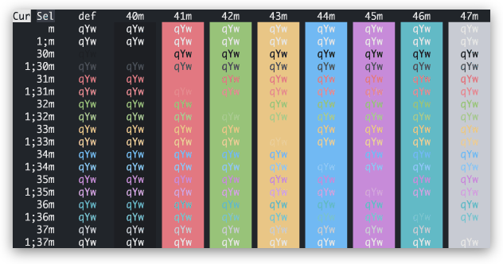

<h3 align="center">
  
   
   
  One Dark Two Theme
   
</h3>

  

One Dark Two is a fresh take on [Atom's](https://github.com/atom/atom) One Dark Two theme. It uses similar colors but provides more contrast and brighter whites to make it easier to read.

Palette

<table>
    <tr>
        <th></th>
        <th>Labels</th>
        <th>Hex</th>
        <th>RGB</th>
        <th>HSL</th>
    </tr>
    <tr>
        <td></td>
        <td>Magenta</td>
        <td><code>#c88bda</code></td>
    </tr>
        <tr>
        <td></td>
        <td>Red</td>
        <td><code>#e27881</code></td>
    </tr>
        <<tr>
        <td></td>
        <td>Orange</td>
        <td><code>#e79c7e</code></td>
    </tr>
    <tr>
        <td></td>
        <td>Yellow</td>
        <td><code>#eac786</code></td>
    </tr>
    <tr>
        <td></td>
        <td>Green</td>
        <td><code>#98c379</code></td>
    </tr>
    <tr>
        <td></td>
        <td>Cyan</td>
        <td><code>#62bac6</code></td>
    </tr>
    <tr>
        <td></td>
        <td>Blue</td>
        <td><code>#71b9f4</code></td>
    </tr>
    <tr>
        <td></td>
        <td>Text</td>
        <td><code>#e6e6e6</code></td>
    </tr>
    <tr>
        <td></td>
        <td>Subtext1</td>
        <td><code>#c9ccd3</code></td>
    </tr>
    <tr>
        <td></td>
        <td>Subtext0</td>
        <td><code>#abb2bf</code></td>
    </tr>
    <tr>
        <td></td>
        <td>Overlay2</td>
        <td><code>#969dab</code></td>
    </tr>
    <tr>
        <td></td>
        <td>Overlay1</td>
        <td><code>#818896</code></td>
    </tr>
    <tr>
        <td></td>
        <td>Overlay0</td>
        <td><code>#6c7280</code></td>
    </tr>
    <tr>
        <td></td>
        <td>Surface2</td>
        <td><code>#5b626d</code></td>
    </tr>
    <tr>
        <td></td>
        <td>Surface1</td>
        <td><code>#4a505a</code></td>
    </tr>
    <tr>
        <td></td>
        <td>Surface0</td>
        <td><code>#393e47</code></td>
    </tr>
    <tr>
        <td></td>
        <td>Base</td>
        <td><code>#282c34</code></td>
    </tr>
    <tr>
        <td></td>
        <td>Mantle</td>
        <td><code>#21252b</code></td>
    </tr>
    <tr>
        <td></td>
        <td>Crust</td>
        <td><code>#1d1f23</code></td>
    </tr>
</table>

## Ports

- [JetBrains IDE](https://github.com/beatreichenbach/one_dark_two)
- [iTerm2-Color-Schemes](https://github.com/mbadolato/iTerm2-Color-Schemes)

## Liecense

One Dark Two is released under the MIT license, see the [LICENSE](LICENSE).

